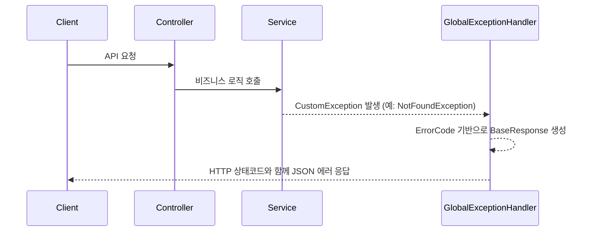
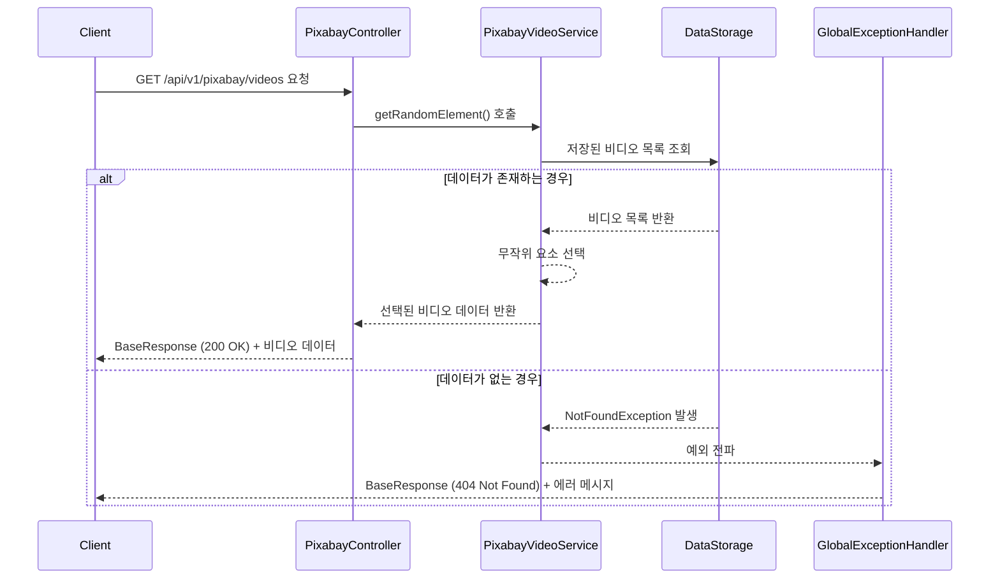
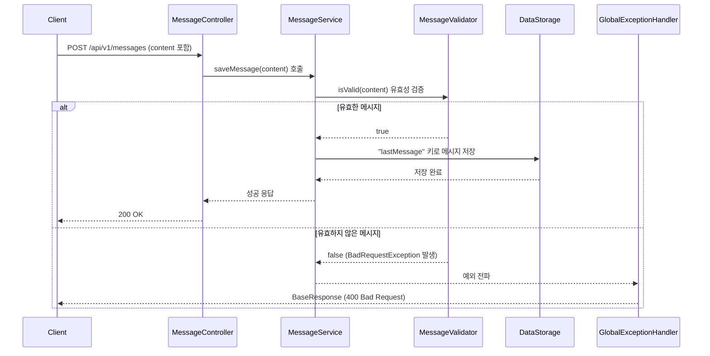
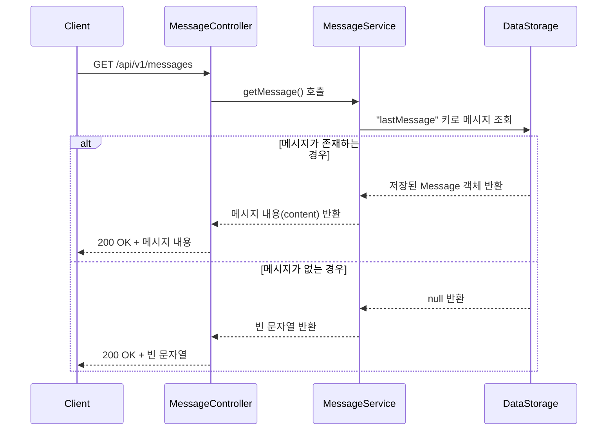

# API 워크플로우 가이드

## 1. 개요

이 문서는 `4d4cat-services` 프로젝트의 전체 워크플로우를 설명합니다. 이 프로젝트는 크게 두 가지 주요 도메인으로 구성됩니다.

-   **Pixabay 도메인**: 외부 Pixabay API와 연동하여 비디오 및 음악 데이터를 조회하는 기능을 제공합니다.
-   **Message 도메인**: 사용자의 메시지를 임시로 저장하고 조회하는 간단한 내부 API 기능을 제공합니다.

프로젝트는 `common`, `pixabay`, `message` 세 개의 주요 패키지로 구조화되어 있으며, 각 도메인은 독립적인 역할을 수행하면서 `common` 패키지의 공통 기능을 공유합니다.

## 2. 공통 아키텍처 (Common Architecture)

`com.services.common` 패키지는 프로젝트 전반에 걸쳐 사용되는 핵심 아키텍처와 공통 기능을 정의합니다.

### 2.1. 계층형 아키텍처

-   **Presentation Layer (`presentation`):** 클라이언트의 HTTP 요청을 수신하고 응답을 반환합니다. `Controller`, `GlobalExceptionHandler`, `DTO` 등이 여기에 속합니다.
-   **Application Layer (`application`):** 핵심 비즈니스 로직을 처리합니다. `Service`, 비즈니스 예외(`CustomException`) 등이 포함됩니다.
-   **Infrastructure Layer (`infrastructure`):** 외부 시스템 연동, 데이터 저장, 설정 등 기술적인 부분을 담당합니다. `RestTemplate` 설정, 외부 API 클라이언트, 인메모리 `DataStorage` 등이 여기에 해당합니다.

### 2.2. 전역 예외 처리 (`GlobalExceptionHandler`)

-   애플리케이션 전역에서 발생하는 예외를 한 곳에서 처리합니다.
-   `CustomException`의 하위 클래스들(`NotFoundException`, `BadRequestException` 등)을 감지하여, `ErrorCode`에 정의된 메시지와 상태 코드를 기반으로 일관된 형식의 에러 응답(`BaseResponse`)을 생성합니다.



### 2.3. AOP를 통한 횡단 관심사 분리 (`DataInitializationAspect`)

-   `@Around` 어노테이션을 사용하여 `DataInitializationService`의 데이터 초기화 과정 전후에 로직을 추가합니다.
-   **주요 기능**:
    -   데이터 초기화 시작/종료 로그 기록
    -   총 실행 시간 측정
    -   성공/실패 여부를 Discord 웹훅을 통해 비동기적으로 알림

### 2.4. 인메모리 데이터 저장소 (`DataStorage`)

-   `ConcurrentHashMap`을 사용하여 멀티스레드 환경에서 안전하게 데이터를 저장하고 조회하는 인메모리 캐시 역할을 합니다.
-   애플리케이션 시작 시 Pixabay 데이터를 미리 로드하여 저장해두고, 클라이언트 요청 시 메모리에서 빠르게 데이터를 조회하여 제공합니다.

## 3. 도메인별 워크플로우

### 3.1. Pixabay 도메인

#### 3.1.1. 애플리케이션 시작 시 데이터 초기화

애플리케이션이 시작되면, `PixabayVideoService`와 `PixabayMusicService`는 각각 필요한 데이터를 외부 API로부터 병렬로 가져와 `DataStorage`에 저장합니다.

```mermaid
graph TD
    A[애플리케이션 시작] --> B(ApplicationReadyEvent 발생);
    B --> C{병렬 초기화};
    C --> D[PixabayVideoService 초기화];
    C --> E[PixabayMusicService 초기화];

    subgraph PixabayVideoService
        D --> D1{카테고리 목록 정의};
        D1 --> D2[각 카테고리별 API 병렬 호출<br/>(ThreadPool 사용)];
        D2 --> D3{Pixabay API<br/>(pixabay.com/api/videos)};
        D3 --> D4[응답 데이터 가공];
    end

    subgraph PixabayMusicService
        E --> E1{장르 목록 정의};
        E1 --> E2[각 장르별 API 병렬 호출<br/>(ThreadPool 사용)];
        E2 --> E3{외부 음악 API<br/>(외부 API 엔드포인트)};
        E3 --> E4[응답 데이터 가공];
    end

    D4 --> F(DataStorage에 비디오 데이터 저장);
    E4 --> G(DataStorage에 음악 데이터 저장);
    
    F & G --> H(데이터 초기화 완료);
```

-   **내결함성**: `CompletableFuture`의 `exceptionally` 블록을 사용하여, 특정 카테고리/장르의 API 호출이 실패하더라도 전체 초기화 프로세스가 중단되지 않습니다. 실패한 호출은 로그만 남기고 건너뜁니다.
-   **AOP 모니터링**: `DataInitializationAspect`가 이 과정의 시작, 성공/실패, 소요 시간을 로깅하고 Discord로 알림을 보냅니다.

#### 3.1.2. 클라이언트 데이터 조회 요청

클라이언트가 비디오 또는 음악 데이터를 요청하면, 컨트롤러는 서비스 계층을 통해 `DataStorage`에 캐시된 데이터를 조회하여 무작위로 하나를 반환합니다.



### 3.2. Message 도메인

#### 3.2.1. 메시지 저장 요청 (POST)

클라이언트가 메시지를 저장하면, `MessageService`는 유효성을 검증한 후 `DataStorage`에 "lastMessage"라는 키로 메시지를 저장합니다.



#### 3.2.2. 메시지 조회 요청 (GET)

클라이언트가 메시지 조회를 요청하면, `DataStorage`에서 "lastMessage" 키로 저장된 메시지를 찾아 반환합니다.



## 4. 핵심 컴포넌트 상세

-   **`DataInitializationService` (추상 클래스)**
    -   **역할**: 외부 API로부터 데이터를 가져와 초기화하는 전체적인 흐름(템플릿)을 정의합니다.
    -   **주요 메서드**:
        -   `setDataStorage()`: `@EventListener(ApplicationReadyEvent.class)`에 의해 호출되며, 데이터 초기화 프로세스를 시작합니다.
        -   `getFetchDataList()`: `CompletableFuture`를 사용하여 여러 필터에 대한 API 호출을 병렬로 실행하고 결과를 취합합니다.
        -   `getBaseUrl()`, `getFilters()` (추상 메서드): 하위 클래스(`PixabayVideoService`, `PixabayMusicService`)가 각 서비스에 맞게 API 엔드포인트와 필터 목록을 구현해야 합니다.

-   **`RestTemplateConfig` 및 `CustomResponseErrorHandler`**
    -   **역할**: 외부 API 통신을 위한 `RestTemplate`을 설정하고, HTTP 에러 응답을 커스텀 예외로 변환하는 핸들러를 등록합니다.
    -   **동작**:
        -   `RestTemplate`은 API 호출 시 4xx 또는 5xx 응답을 받으면 `CustomResponseErrorHandler`를 실행합니다.
        -   `CustomResponseErrorHandler`는 HTTP 상태 코드에 따라 `NotFoundException`, `BadGatewayException` 등 적절한 `CustomException`을 발생시킵니다.
        -   이 예외는 서비스 로직(`fetchDataForFilter`)에서 `catch`되거나, `GlobalExceptionHandler`로 전파되어 처리됩니다.
